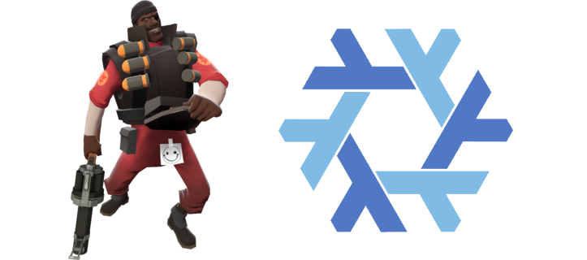

# My NixOS & Home Manager Configs

<p align="center">
  
</p>

These are my personal NixOS and Home Manager dotfiles, built with Flakes.

## Problems to solve

+ Linux-dependent code. Some of paths are hardcoded to use either /home directory or ~/.config, which is not suitable for MacOS.
+ Standalone home-manager packages. For now most of the packages are managed via nixos-rebuild, and if you don't have one, there is no way to build it on linux.

## Key Things

*   **Modular:** Settings are split into modules for easier management.
*   **Auto-Discovers Hosts:** New machines/profiles in `hosts/` are picked up automatically.
*   **Per-Host System Arch:** Each host specifies its architecture (e.g., `x86_64-linux`) in `hosts/your-hostname/system.nix`.
*   **Dual Mode:** Works for full NixOS setups (with Home Manager) or standalone Home Manager.

## How to Apply

1.  **NixOS System (includes Home Manager):**
    ```bash
    sudo nixos-rebuild switch --flake .#hostname
    ```
    *(Replace `hostname` with yours, e.g., `gaming-laptop`)*

2.  **Standalone Home Manager:**
    (For just user configs, e.g., on non-NixOS or a separately managed user)
    ```bash
    home-manager switch --flake .#hostname
    ```
    *(Replace `hostname` with yours, e.g., `gaming-laptop`)*

## Adding a New Machine/Profile

See the [guide in the hosts directory](./hosts/README.md).

## Notes

- All modules are using catppuccin color scheme, there is no plan to make it configurable.
- I use AI to generate some configs, I'll be remaking them in the future.
